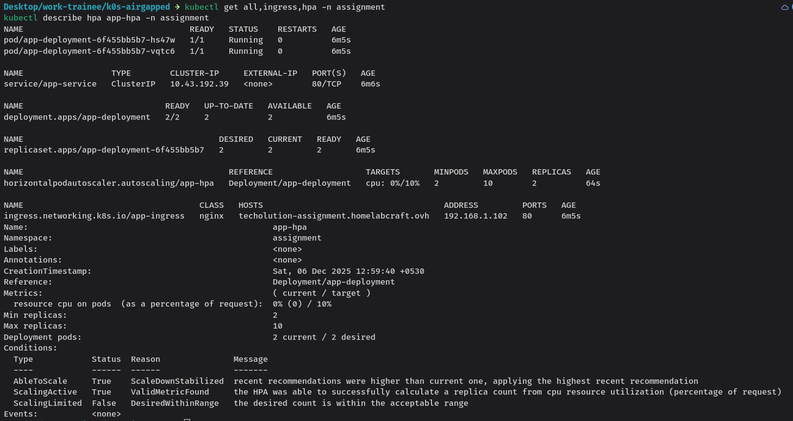
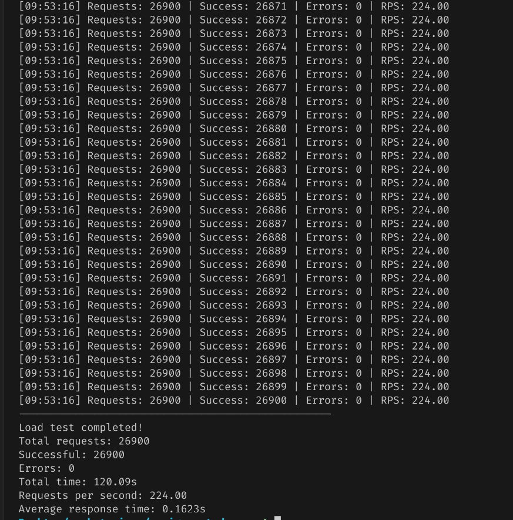
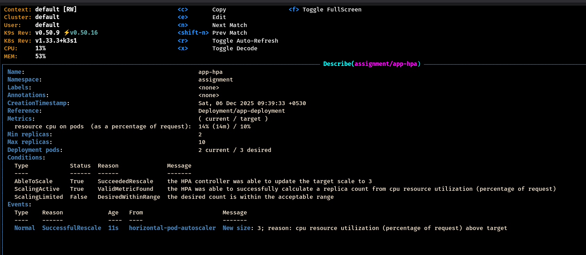
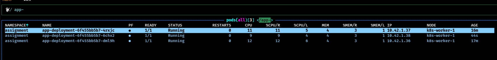
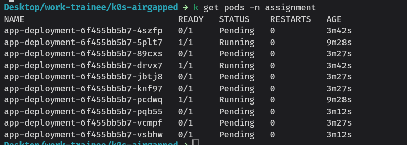
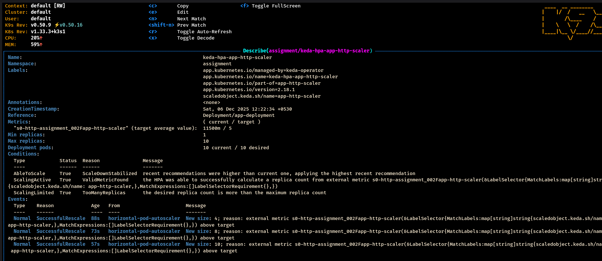

# Kubernetes Autoscaling Assignment

## 🏠 Homelab Setup

Running on my personal K3s cluster:
- **2-node cluster** (1 master + 1 worker) | 6 cores, 16GB RAM
- **Nginx ingress controller** with Cloudflared tunnel for external access
- **TLS handled by Cloudflare** - no cert-manager needed
- **Domain**: techolution-assignment.homelabcraft.ovh
- **Deployed with Kustomize** for clean manifest management

## Prerequisites

- K3s cluster running and accessible
- kubectl configured
- Helm 3.x installed
- Python 3.8+ with `requests` library
- Kustomize CLI

## Project Structure

```bash
assignment-devops/
├── base/                      # Base Kubernetes manifests
│   ├── kustomization.yaml
│   ├── namespace.yaml
│   ├── deployment.yaml        # Nginx image with resource limits
│   └── svc.yaml               # ClusterIP service
├── overlays/
│   ├── hpa/                   # Part 1: CPU-based autoscaling
│   │   ├── kustomization.yaml
│   │   ├── hpa.yaml           # HPA configuration
│   │   └── ingress.yaml       # Direct app ingress
│   └── keda/                  # Part 2: HTTP-based autoscaling
│       ├── kustomization.yaml # Includes Helm charts for KEDA and http-addon
│       ├── namespace.yaml
│       ├── http-scaled-object.yaml
│       └── keda.yaml         # KEDA interceptor ingress
├── assets/                   # Screenshots and evidence
│ 
├── load-test.py              # Python load testing script
└── README.md
```

## Part 1: CPU-Based HPA

### 1. Deploy Application with HPA

```bash
kustomize build overlays/hpa | kubectl apply -f -
```

### 2. Verify Deployment

```bash
kubectl get all,hpa -n assignment
kubectl describe hpa app-hpa -n assignment
```

eg.



### 3. Test Application

```bash
curl https://techolution-assignment.homelabcraft.ovh
```

Expected output:
```html
<html><body><h1>Hello</h1><p>This is running on Saurabh's homelab</p></body></html>
```

### 4. HPA Configuration

- **Min replicas**: 2
- **Max replicas**: 10
- **Target CPU**: 10% utilization
- **Resource requests**: 100m CPU, 128Mi memory
- **Resource limits**: 200m CPU, 256Mi memory

### 5. Run Load Test

Install dependencies:
```bash
pip install requests
```

Run load test:
```bash
python load-test.py --url https://techolution-assignment.homelabcraft.ovh --concurrency 100 --duration 120
```
*Load test generating traffic to trigger CPU-based scaling*




### 6. Observe Scaling Behavior


*HPA events showing scale-up and scale-down decisions. update the target to 3*


### 7. Results


*HPA scaling pods from 2 to 3 replicas based on CPU utilization*


## Part 2: KEDA HTTP-Based Autoscaling

### 1. Switch to KEDA

Remove HPA deployment:
```bash
kustomize build overlays/hpa | kubectl delete -f -
```

### 2. Deploy KEDA with HTTP Add-on

Using Kustomize (includes Helm charts):
```bash
kustomize build overlays/keda --enable-helm | kubectl apply -f - --server-side 
```
### 3. Verify KEDA Installation

```bash
kubectl get pods -n keda
kubectl get httpscaledobject -n assignment
kubectl get scaledobject -n assignment
```

### 4. KEDA Configuration

- **Min replicas**: 2
- **Max replicas**: 10
- **Target pending requests**: 10
- **Scaledown period**: 30 seconds
- **Interceptor**: Routes traffic through KEDA proxy for request counting

### 5. Run Load Test

```bash
python load-test.py --url https://techolution-assignment.homelabcraft.ovh --concurrency 100 --duration 180
```

Monitor KEDA scaling:
```bash
watch kubectl get scaledobject,pods -n assignment

# Check KEDA operator logs
kubectl logs -n keda -l app=keda-operator -f
```

### 6. Verify HTTPScaledObject Status

```bash
kubectl describe httpscaledobject app-http-scaler -n assignment
kubectl describe scaledobject app-http-scaler -n assignment
```

### 7. Results


*KEDA scaling pods based on HTTP request rate*


*KEDA operator logs showing HTTP-based scaling decisions*

## Load Testing Script

The `load-test.py` script supports:

```bash
python load-test.py --url <URL> --concurrency <NUM> --duration <SECONDS>
```

**Options:**
- `--url`: Target URL (required)
- `--concurrency`: Number of concurrent requests (default: 50)
- `--duration`: Test duration in seconds (default: 120)

**Example:**
```bash
python load-test.py --url https://techolution-assignment.homelabcraft.ovh --concurrency 150 --duration 180
```

## Cleanup

### Remove KEDA & deployment manifests file

```bash
kustomize build overlays/keda | kubectl delete -f -
```
